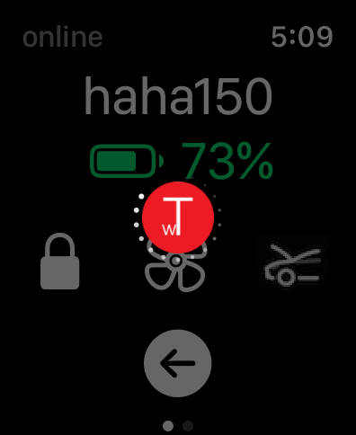
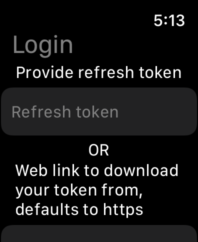
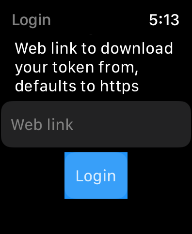
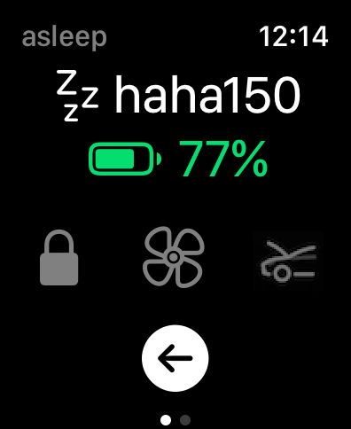
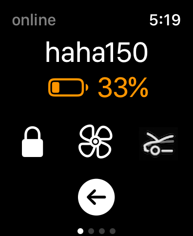
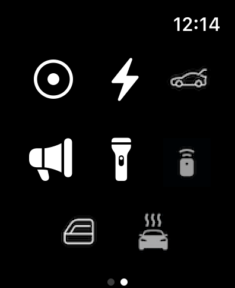
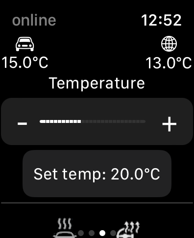
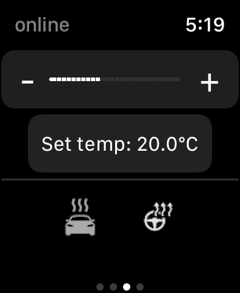
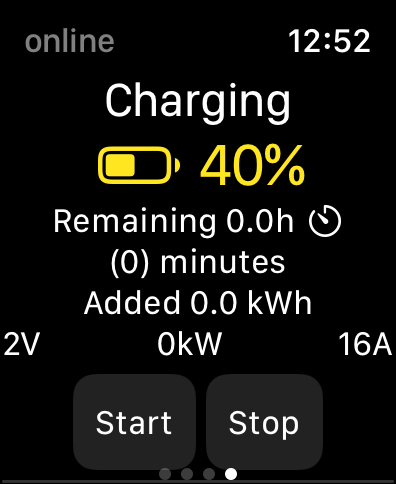
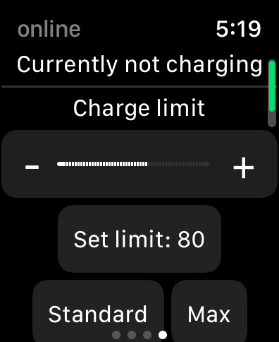

# wTesla-IOS

This project is a standalone Tesla app for the Apple watch with all the features that the official Tesla app has.

The main purpose for creating this app is to essentially make the competitor "Watch app for Tesla" obsolete. To be honest, the competitor is scamming people out of $11.99 and personally i dont like this kind of behaviour. Link to competitor for reference: [trash](https://apps.apple.com/us/app/watch-app-for-tesla/id1512108917).

With that being said, i am at a point where i am considering publishing it to the app store either for free or $1 or $2.

The app is still being developed to finish implementing all features that the official Tesla app has as well as the competitor has.

## Login

Currently, you have to provide your token to the app for it to download it and be able to use your account, the token has to be in a specific format, see token.txt:

```
{
  "access_token": "eyJaccess",
  "refresh_token": "eyJrefresh",
  "id_token": "id",
  "expires_in": 300,
  "token_type": "Bearer"
}
```

### Alternative 1: Steps to login with refresh token

1. Generate your token following [this](https://tesla-api.timdorr.com/api-basics/authentication).
2. Copy the refresh_token
3. Provide the refresh_token in the app login page, you only need to this one time
4. Enjoy

### Alternative 2: Steps to login with full token

1. Generate your token following [this](https://tesla-api.timdorr.com/api-basics/authentication).
2. Save it to a file
3. Host the file on a webserver/fileserver that the app can access
4. Provide the link to the token in the app login page, you only need to this one time
5. Enjoy

> The reason the app uses this way to login is due to Teslas authentication process, as soon as they provide a better way to authenticate using e.g. credentials, i will update the app.

## Current features

* Login with refresh token
* Login with full token
* Logout
* List all vehicles
* Select specific vehicle
* Wake up vehicle
* View vehicle name
* View vehicle battery
* Lock/unlock vehicle
* Turn on/off HVAC
* Open frunk
* Open/close trunk
* Turn on/off sentry mode
* Open/close charge port
* Honk horn
* Flash lights
* Remote start
* Vent/close windows
* View climate
* Set climate temperature
* Defrost vehicle
* Turn on/off steering wheel heater
* View charging stats
* Set charging limit
* Start/stop charging
* Unlock charging port

## Feature request

If there is some feature that you want to be implemented in the app, create a issue on this github page and i will take a look.

## Have questions or require assistance?

Create a issue on this github page.

## Donate

I will never ask for donations, however if you like the app and would like to help out, you can donate if you wish

[](https://www.paypal.com/donate/?business=88CWQTFPPYNJ4&no_recurring=1&item_name=Tesla+Apple+Watch&currency_code=EUR)


## Some screenshots:













